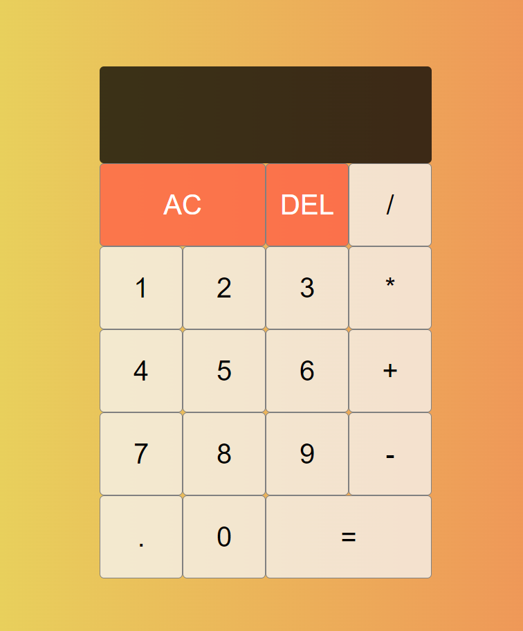

# 🧮 Calculator made with React

Simple calculator app made by React (useReducer hook).

# Built with

- JavaScript, React(v18.2)

# Reach the App

You need to follow these steps to reach the project
1-Clone the repo
2-In the project directory, you can run `npm install`
3-Run `npm start`

You can reach the project here, [calculator](https://berenvrl.github.io/react-calculator/)

# Visual of the project

